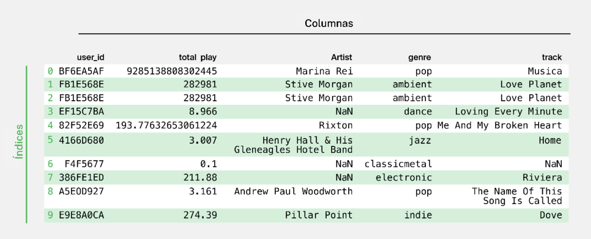
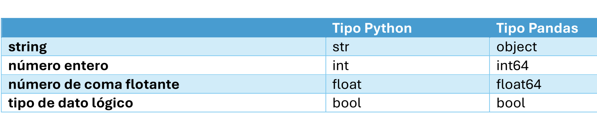

# Introduccion

## Que es?

El proceso de utilizar datos para responder preguntas, identificar tendencias y extraer conocimientos.

## Tipos clave de análisis de datos

- Análisis descriptivo pregunta: "¿Qué pasó?"
- Análisis predictivo pregunta: "¿Qué podría pasar en el futuro?"
- Análisis prescriptivo pregunta: "¿Qué se debe hacer a continuación?"
- Análisis de diagnóstico pregunta: "¿Por qué sucedió esto?"

## Fases del proceso del análisis de datos.

1. HACER PREGUNTAS Y DEFINIR EL PROBLEMA.
2. PREPARAR DATOS RECOPILAR Y ALMACENAR LOS DATOS.
3. PROCESAR LOS DATOS AL LIMPIAR Y COMPROBAR LA INFORMACIÓN.
4. ANALIZAR LOS DATOS PARA ENCONTRAR PATRONES, RELACIONES Y TENDENCIAS.
5. PRESENTAR DATOS.
6. MONITOREAR Y EVALUAR LOS RESULTADOS

## Estructura del DataFrame

Un DataFrame es una estructura de datos bidimensional, que es esencialmente una tabla donde cada elemento tiene dos coordenadas: una fila y una columna. Se accede a las filas por los índices y a las columnas por sus nombres.

Las filas suelen representar una sola entidad, mientras que las columnas describen los atributos de estas entidades.

Llamar a un atributo es similar a llamar a un método,
excepto que los atributos no van seguidos de paréntesis.

## Tipos de datos en pandas

Los valores nulos o ausentes deben procesarse antes de pasar al análisis de los datos.

## ¿Qué es un Sandbox?

entorno de programación seguro donde el código puede ser ejecutado sin afectar los recursos de red o las aplicaciones locales.
con un IDE es importante llamar a print(), o de lo contrario no se mostrará nada en la sección de resultados.

## ¿Qué es el aprendizaje no supervisado?

es un tipo de aprendizaje automático sin una característica objetivo
los algoritmos encuentran relaciones entre las observaciones por sí mismos.
La elección del algoritmo depende del tipo de problema.
