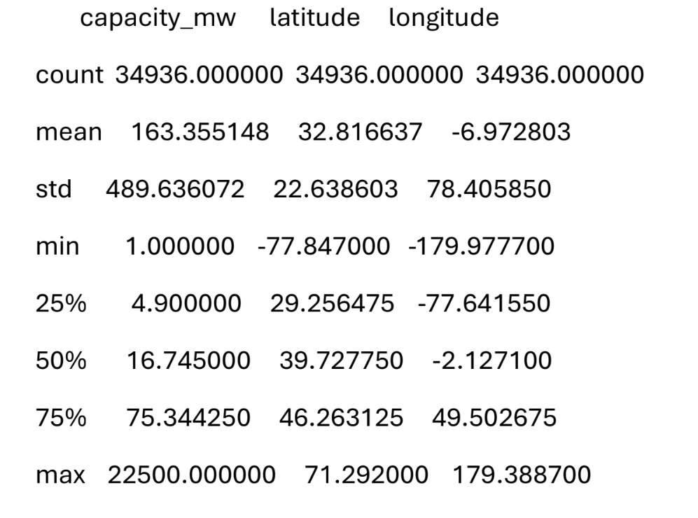
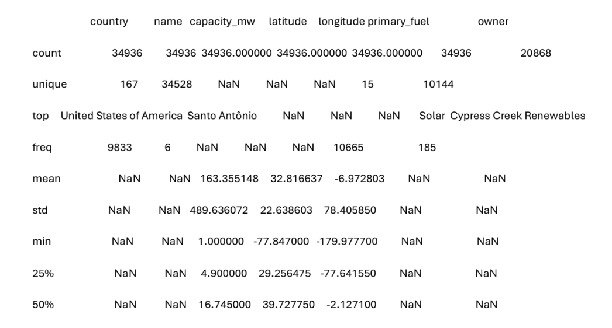
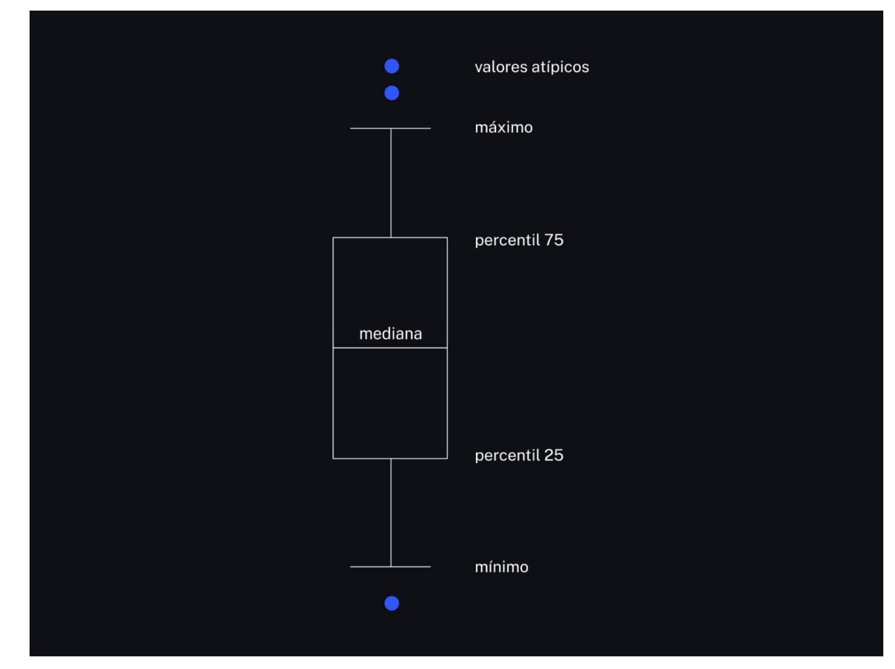
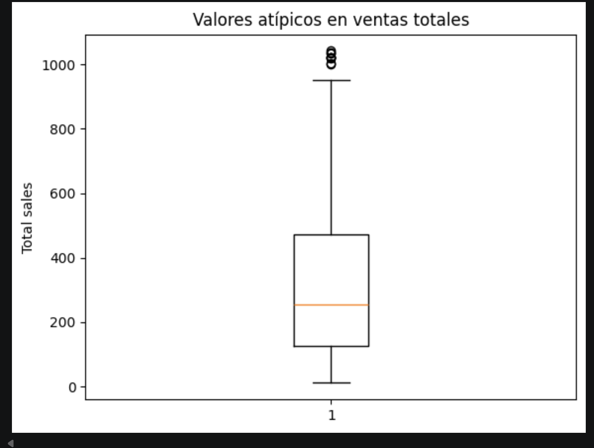

# Desviacion estandar

Una medida que nos dice qué tan "rebeldes" o "dispersos" son los datos.

Nos indica qué tanto se alejan, en promedio, los datos respecto al valor central (el promedio o la media).

### Imagina que tenemos dos grupos de estudiantes y ambos grupos tienen un promedio de calificación de 80.

Grupo A: Todos sacaron exactamente 80. (Aquí no hay dispersión; la desviación estándar es 0).

Grupo B: Unos sacaron 100, otros 60, otros 90 y otros 70. El promedio sigue siendo 80, pero los datos están muy variados. (Aquí hay una desviación estándar alta).

Un valor por sí solo no significa si es "mucho" o "poco". Todo depende de cuál sea tu promedio y de qué estés midiendo.

Significa que, en promedio, los datos se alejan x unidades de la media.

# Descripciones numéricas

Puedes llamar a describe() en un DataFrame o en un Series

        print(data.describe())
        print(data['capacity_mw'].describe())

De forma predeterminada, se ignoran las columnas no numericas

# Descripciones no numéricas

        print(data['country'].describe())

'top': el valor que aparece con más frecuencia;

Solo las columnas no numéricas:

        print(data.describe(include='object'))

# Descripcion para todos los datos

        print(data.describe(include='all'))

# ¿Qué es la regresión lineal?

La regresión lineal es una técnica de análisis de datos que predice el valor de datos desconocidos mediante el uso de otro valor de datos relacionado y conocido(predecir el valor de una variable en función del valor de otra variable).

- La variable que desea predecir se llama variable dependiente.
- La variable que está utilizando para predecir el valor de la otra variable se llama variable independiente.

Los científicos de datos primero entrenan el algoritmo en conjuntos de datos conocidos o etiquetados y, a continuación, utilizan el algoritmo para predecir valores desconocidos.

Debe existir una relación lineal entre las variables independientes y las dependientes. Para determinar esta relación, los científicos de datos crean una gráfica de dispersión.

Los científicos de datos utilizan residuos para medir la precisión de la predicción. Un residuo es la diferencia entre los datos observados y el valor previsto.

### Normalidad

Las gráficas Q-Q, determinan si los residuos se distribuyen normalmente. Si los residuos no están normalizados, puede probar los datos para detectar valores atípicos aleatorios o valores que no sean típicos. Eliminar los valores atípicos o realizar transformaciones no lineales puede solucionar el problema.

### Homocedasticidad

La homocedasticidad supone que los residuos tienen una variación constante o desviación estándar de la media para cada valor de x. De lo contrario, es posible que los resultados del análisis no sean precisos. Si no se cumple esta suposición, es posible que tenga que cambiar la variable dependiente.

# ¿Cuáles son los tipos de regresión lineal?

Regresión lineal simple: modelar la relación entre dos variables
Regresión lineal múltiple: el conjunto de datos contiene una variable
dependiente y múltiples variables independientes

# Regresión logística

Medir la probabilidad de que se produzca un evento. La predicción es un valor entre 0 y 1, donde 0 indica un evento que es poco probable que ocurra y 1 indica una probabilidad máxima de que suceda.

# 2. Creación del Modelo Regresión Lineal.

1. Obtener informacion
2. Realizar limpieza
3. One-Hot Encoding.
4. Definir x y y
5. Hacer el split de entrenamiento, test y valid
6. Crear el modelo LinearRegression()
7. Entrenar el modelo con .fit(x, y)
8. Usar predict para obtener los valores a comprobar
9. Evaluar el modelo

## Dimenciones de X y Y

Por defecto, y es una Serie de Pandas, básicamente una lista unidimensional (un vector plano).

El problema es que LinearRegression de sklearn es muy estricto: siempre espera una matriz de dos dimensiones (filas, columnas) tanto para las características (X) como para las etiquetas (Y)

#### ¿Qué hace reshape((-1, 1))?

El método .reshape() cambia la "forma" de tu arreglo sin cambiar los datos que contiene.

La sintaxis recibe dos argumentos: (filas, columnas). Al pasarle (-1, 1), le estás dando una instrucción muy específica a Python:

El 1 (Columnas)
El -1 (Filas): Todas las filas en una sola columna

# Error Cuadrático Medio (ECM)

MSE (Mean Squared Error).

RMSE (Root Mean Squared Error).

Medida estadística que se utiliza para evaluar la calidad de un modelo
predictivo. Nos indica qué tan lejos están, en promedio, las
predicciones de nuestro modelo de los valores reales.

## ¿Cómo se calcula el ECM?

1. Calcular la diferencia entre el valor real y el valor predicho para cada dato
2. Elevar al cuadrado cada diferencia: penalizar más los errores
   grandes
3. Calcular el promedio

Aunque el ECM no tiene una interpretación directa en unidades
físicas, nos proporciona una medida numérica de la precisión de nuestro modelo.

# Casos de Uso de Regresión Lineal Simple

Para un modelo de regresión lineal simple, la clave está en que solo podemos utilizar una única variable predictora (X) para estimar la variable de respuesta (Y).

- Crea un modelo de Regresión Lineal Simple para predecir consumo de combustible según la distancia
- Consumo eléctrico
  residencial
- Estimación del salario basado en los años de experiencia

# Regresión Lineal Múltiple

Calcular el target en base a 2 o + features.

La regresión múltiple reconoce que el mundo real es complejo y que un fenómeno casi siempre está determinado por múltiples factores a la vez.

# Regresion logistica

Análisis de clasificación utilizado para predecir el resultado de una variable categórica (número limitado de categorías). Es útil para modelar la probabilidad de un evento ocurriendo en función de otros factores. Las probabilidades que describen el posible resultado de un único ensayo se modelan como una función de variables explicativas, utilizando una función logística.

La regresión logística es una técnica de análisis de datos que utiliza las matemáticas para encontrar las relaciones entre dos factores de datos. Luego, utiliza esta relación para predecir el valor de uno de esos factores basándose en el otro.

Para la regresión logística, hay que formular la pregunta para obtener resultados concretos:

- ¿Los días de lluvia afectan nuestras ventas mensuales? (sí o no)
- ¿Qué tipo de actividad de tarjeta de crédito realiza el cliente? (autorizado, fraudulento o potencialmente fraudulento)

En estadística, las variables son los factores o atributos de datos cuyos valores varían. Para cualquier análisis, ciertas variables son independientes o explicativas. Otras variables son variables dependientes o de respuesta; sus valores dependen de las variables independientes.

### Regresión logística binaria

Funciona bien para problemas de clasificación binaria que solo tienen dos resultados posibles. La variable dependiente solo puede tener dos valores, como sí y no o 0 y 1.

### Regresión logística multinomial

La regresión multinomial puede analizar problemas que tienen varios resultados posibles, siempre y cuando el número de resultados sea finito. Por ejemplo, puede predecir si los precios de la vivienda aumentarán un 25 %, 50 %, 75 % o 100 % en función de los datos de
población, pero no puede predecir el valor exacto de una casa. La regresión logística multinomial funciona mapeando los valores de resultado con diferentes valores entre 0 y 1.

### Regresión logística ordinal

Es un tipo especial de regresión multinomial para problemas en los que los números representan rangos en lugar de valores reales.

## Regresión logística vs. regresión lineal

La regresión lineal predice una variable dependiente continua mediante el uso de un conjunto dado de variables independientes. Una variable continua puede tener un rango de valores.

A diferencia de la regresión lineal, la regresión logística es un algoritmo de clasificación. No puede predecir los valores reales de los datos continuos.

El aprendizaje profundo utiliza redes neuronales o componentes de software que simulan el cerebro humano para analizar la información. Los cálculos de aprendizaje profundo se basan en el concepto matemático de vectores.

La regresión logística es menos compleja y requiere menos recursos informáticos que el aprendizaje profundo. Y lo que es más importante, los desarrolladores no pueden investigar ni modificar los cálculos de aprendizaje profundo, debido a su naturaleza compleja y dirigida por la máquina. Por otro lado, los cálculos de regresión logística son transparentes y más fáciles de solucionar

La regresión logística binaria es el algoritmo de clasificación por excelencia en Machine Learning cuando la variable que queremos predecir (Y) es categórica y tiene únicamente dos resultados posibles (sí/no, verdadero/falso, 1/0, éxito/fracaso).

Existen algoritmos de clasificación (e incluso versiones de la regresión logística) que soportan más de dos categorías. A esto se le conoce en la industria como Clasificación Multiclase (Multiclass Classification).

# Arbol de decisión - Decision Tree

Funcionan como un diagrama de flujo, toma decisiones complejas rompiendolas en series de preguntas basadas en los datos.

## Componentes

- Nodo Raíz (Root Node): primera pregunta del arbol, caracteristica mas importante
- Nodos de Decisión o Internos (Split Nodes): preguntas intermediarias, se llaman bifurcacion o subpregunta
- Nodos Hojas (Leaf Nodes): extremos finales del árbol. Ya no contienen preguntas, sino la respuesta o predicción final

## ¿Cómo sabe el algoritmo qué preguntas hacer primero?

Tú no tienes que inventar las preguntas; el algoritmo analiza tu base de datos y calcula matemáticamente cuál es la mejor variable para empezar a dividir los grupos.

1. Entropía / Ganancia de Información: grupo. El algoritmo busca preguntas que separen los datos en grupos lo más puros posibles (por un lado puros "SÍ" y por el otro puros "NO").
2. Impureza de Gini: mide la probabilidad de clasificar incorrectamente un elemento si lo eligieras al azar. El algoritmo quiere que la impureza llegue a cero.

## Tipos de Árboles de Decisión

- Árboles de Clasificación: Cuando la respuesta final es una categoría
- Árboles de Regresión: Cuando la respuesta final es un número continuo

## Problemas

Los árboles de decisión son "tercos". Si los dejas crecer sin control, harán preguntas tan específicas para ajustarse a tus datos de entrenamiento que memorizarán el dataset (Overfitting o sobreajuste).

En el análisis de datos, las filas se llaman instancias, mientras que las columnas son las variables.

En el machine learning, las filas y columnas representan observaciones
y características, respectivamente.

La característica que necesitamos predecir se llama objetivo.

# Ramdon Forests

Este algoritmo entrena una gran cantidad de árboles independientes y toma una decisión mediante el voto. Un bosque aleatorio ayuda a mejorar los resultados y a evitar el sobreajuste.

Sabes por qué la gente vota cuando hay que tomar decisiones importantes? De esta forma puedes obtener una valoración promedio que anule el sesgo personal y los errores.

Usaremos el hiperparámetro n_estimators para establecer el número de árboles en el bosque.
El aumento en la cantidad de estimadores siempre disminuye la varianza de la predicción, por lo que cuantos más árboles uses, mejores resultados obtendrás.

Los bosques no pueden sobreajustarse debido a que tienen demasiados árboles. Si bien el sobreajuste de un bosque aún puede ocurrir debido
al sobreajuste de sus árboles individuales, este efecto generalmente se ve compensado por el beneficio de tener muchos árboles.

El uso de más y más árboles incurre en un costo computacional cada vez mayor y sufre de rendimientos decrecientes. Eventualmente, la métrica de calidad del modelo alcanza una meseta y deja de mejorar, mientras que el tiempo de ejecución sigue aumentando.

# Aprendizaje no supervisado

Utiliza algoritmos de machine learning (ML) para analizar y agrupar conjuntos de datos sin etiquetar. Estos algoritmos descubren patrones ocultos o agrupaciones de datos sin necesidad de intervención humana.

### tareas principales para el aprendizaje no supervisado:

- clustering
- asociación
- reducción de dimensionalidad

## Agrupación en clústeres

Agrupa datos sin etiquetar en función de sus similitudes o diferencias. Se empleanpara procesar objetos de datos (sin procesar y sin clasificar) en grupos representados por estructuras o patrones en la información.

### Tipos de algoritmos de agrupación en clústeres:

- exclusivos
- superpuestos
- jerárquicos
- probabilísticos

# Agrupación en clústeres exclusiva

Forma de agrupación que estipula: un punto de datos sólo puede existir en un conglomerado (agrupación en clústeres "dura")

## Agrupación en clústeres de K-means

Ejemplo común de método de clustering exclusivo; en el que los puntos de datos se asignan a K grupos, donde K representa el número de clusters basado en la distancia desde el centroide de cada grupo. Los puntos de datos más cercanos a un centroide determinado se agruparán en la misma categoría.

Un valor K mayor indica agrupaciones más pequeñas con más detalle, mientras que un valor K menor indica agrupaciones más grandes y menos detalle.

# Agrupación en clústeres superpuesta

Permite que los puntos de datos pertenezcan a múltiples clústeres con grados separados de pertenencia.

Con el aprendizaje no supervisado, descubrirás cómo buscar patrones en datos sin etiquetar. El aprendizaje no supervisado es un tipo de aprendizaje automático sin una característica objetivo: los algoritmos encuentran relaciones entre las observaciones por sí mismos. La elección del algoritmo depende del tipo de problema.

# Clustering

el modelo busca relaciones entre las observaciones. El análisis de clústeres (clustering) es la tarea de combinar observaciones similares en grupos o clústeres.

La mayoría de los métodos de clustering implican determinar la similitud o diferencia de las observaciones con base en la distancia entre ellas. Cuanto más lejos estén las observaciones entre sí, menos similares serán, y viceversa.

# Clustering de k-means

El concepto clave de este algoritmo es el centroide, o el centro de un clúster. El grado de cercanía a un centro en particular depende de a qué clúster pertenece la observación. Cada clúster tiene su propio centroide, que se calcula como la media aritmética de las observaciones agrupadas.

K-Means: toma datos que no tienen etiquetas y los divide en grupos basados en qué tan cerca están unos de otros. La "K" es el número de grupos (o clusters) que tú decides crear, y "Means" (medias) se refiere al centro geométrico de cada grupo.

Otra condición para detener el trabajo del algoritmo es el hiperparámetro para el máximo número de iteraciones (max_iter).

Consejo fundamental para principiantes sobre K-Means:

Escalar siempre los datos: K-Means calcula distancias matemáticas (como la distancia euclidiana) para agrupar los puntos. Si una variable está en miles y otra en unidades, la variable de ingresos va a dominar por completo el algoritmo.

El algoritmo **K-means** es un método de agrupamiento (**clustering**) que busca particionar un conjunto de datos en k grupos o clusters.

Funciona asignando iterativamente cada dato al cluster cuyo centroide (media del grupo) esté más cercano, y luego recalculando estos centroides hasta que la asignación se estabilice.

**max_iter:** Indica el número máximo de iteraciones permitidas en cada ejecución del algoritmo. Si se alcanza este límite sin que la asignación de los datos cambie, el proceso se detiene.

Los **centroides** son los puntos que representan el **centro de cada grupo o cluster**. En el contexto de K-Means, cada centroide se calcula como la media de todas las características de los puntos asignados a ese cluster. Durante el algoritmo, estos centroides _se actualizan iterativamente para reflejar mejor la posición central de sus respectivos clusters_, ayudando a optimizar la agrupación de los datos.

# Detección de anomalías:

Las anomalías, o valores atípicos, son observaciones con propiedades anormales (es decir, aquellas que se desvían de la tendencia normal). Los valores atípicos indican un problema en los datos o que algo está fuera de lo normal.

Dado que los valores atípicos suelen ser impredecibles y poco comunes, durante el entrenamiento aparecen pocas o ninguna anomalía.

# Isolation Forest

uno de los métodos más eficientes y utilizados en Machine Learning para la Detección de Anomalías.

Funciona aislando directamente las anomalías. Como los datos anómalos son pocos y tienen características muy distintas, se necesitan muy pocas divisiones para separarlos por completo del resto.

Sus cálculos se basan en las estimaciones promediadas de varios árboles de solución. Los nodos del árbol contienen las reglas de decisión que asignan cada observación a una rama específica.

Se basa en el hecho de que las anomalías se pueden aislar del resto mediante un pequeño número de reglas de decisión.

Se construye como un árbol de decisión, pero las reglas de decisión para este se eligen al azar. Las observaciones situadas a poca profundidad se pueden aislar fácilmente y se consideran anómalas, mientras
que el resto se consideran normales.

Seleccionar anomalías por una característica no te dará una representación precisa del conjunto de datos completo. Un bosque de aislamiento detecta valores atípicos con base en varias características.

Las estimaciones de anomalías varían entre -0.5 y 0.5. Una estimación más baja indica una mayor probabilidad de que la observación sea un valor
atípico.

Si la clase de observación es 1, la observación es normal, pero si es -1, es un valor atípico.

# Diagrama de caja

Necesitamos encontrar los pocos números que difieren mucho de los demás.

Vamos a compararlos con la mediana en un diagrama de caja, que también se llama gráfico de caja y bigotes debido a las líneas que se extienden desde las cajas como bigotes.

Los límites superior e inferior de la caja marcan los cuartiles primero y tercero (75% y 25% de los valores). La mediana se ubica en el centro (50% de los valores). Los "bigotes" se extienden hacia arriba y hacia abajo desde los bordes de la caja hasta una distancia de 1.5 intervalos intercuartílicos (IQR) e indican la variabilidad fuera de los cuartiles inferior y superior.

Los valores atípicos se muestran fuera de los límites de los bigotes (el mínimo y el máximo).

