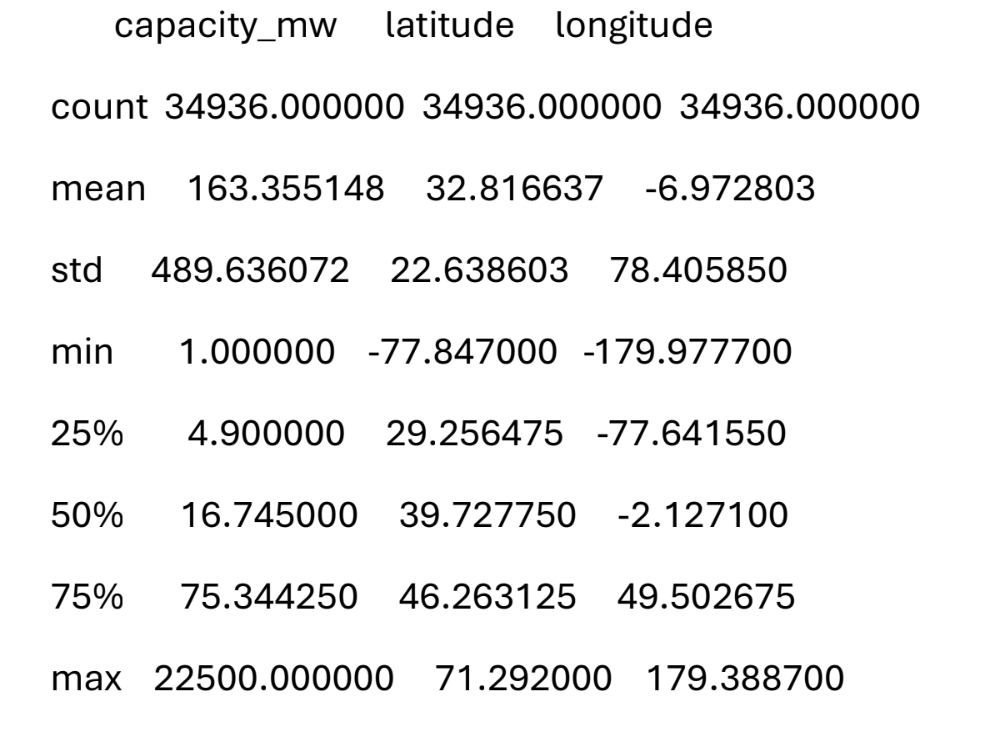

# Desviacion estandar
Una medida que nos dice qué tan "rebeldes" o "dispersos" son los datos.

Nos indica qué tanto se alejan, en promedio, los datos respecto al valor central (el promedio o la media).

### Imagina que tenemos dos grupos de estudiantes y ambos grupos tienen un promedio de calificación de 80.

Grupo A: Todos sacaron exactamente 80. (Aquí no hay dispersión; la desviación estándar es 0).

Grupo B: Unos sacaron 100, otros 60, otros 90 y otros 70. El promedio sigue siendo 80, pero los datos están muy variados. (Aquí hay una desviación estándar alta).

Un valor por sí solo no significa si es "mucho" o "poco". Todo depende de cuál sea tu promedio y de qué estés midiendo.

ignifica que, en promedio, los datos se alejan x unidades de la media.

# Descripciones numéricas
Puedes llamar a describe() en un DataFrame o en un Series

        print(data.describe())

De forma predeterminada, se ignoran las columnas no numericas

