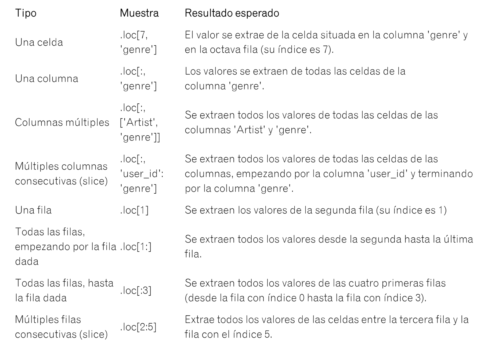

# Indexación por coordenadas
La indexación permite acceder a una celda determinada de la tabla utilizando dos coordenadas: el número de la fila y el nombre de la columna.

Mediante la indexación es posible solicitar celdas individuales y grupos de celdas. Por ejemplo, puedes acceder a:
- todas las celdas de una fila determinada;
- todas las celdas de varias filas;
- todas las celdas de un rango de filas.

        result = df.loc[4, 'genre']

De forma similar a la segmentación de listas, puedes obtener un rango de valores de
una tabla especificando el principio y el final de una segmentación, separados por dos
puntos :

