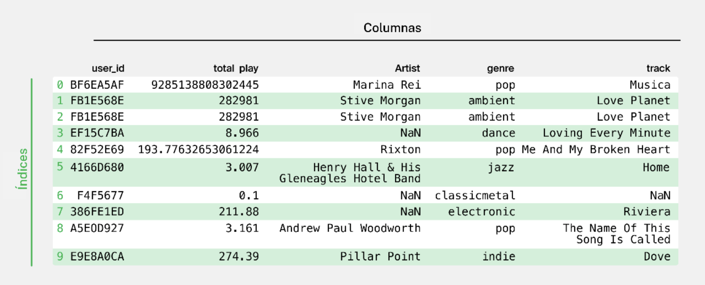
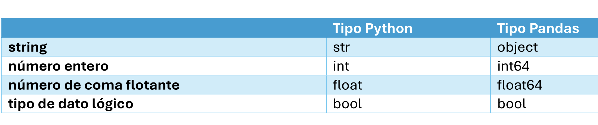

# Introduccion

## Que es?

El proceso de utilizar datos para responder preguntas, identificar tendencias y extraer conocimientos.

## Tipos clave de análisis de datos

- Análisis descriptivo pregunta: "¿Qué pasó?"
- Análisis predictivo pregunta: "¿Qué podría pasar en el futuro?"
- Análisis prescriptivo pregunta: "¿Qué se debe hacer a continuación?"
- Análisis de diagnóstico pregunta: "¿Por qué sucedió esto?"

## Fases del proceso del análisis de datos.

1. HACER PREGUNTAS Y DEFINIR EL PROBLEMA.
2. PREPARAR DATOS RECOPILAR Y ALMACENAR LOS DATOS.
3. PROCESAR LOS DATOS AL LIMPIAR Y COMPROBAR LA INFORMACIÓN.
4. ANALIZAR LOS DATOS PARA ENCONTRAR PATRONES, RELACIONES Y TENDENCIAS.
5. PRESENTAR DATOS.
6. MONITOREAR Y EVALUAR LOS RESULTADOS

## Estructura del DataFrame

Un DataFrame es una estructura de datos bidimensional, que es esencialmente una tabla donde cada elemento tiene dos coordenadas: una fila y una columna. Se accede a las filas por los índices y a las columnas por sus nombres.

Las filas suelen representar una sola entidad, mientras que las columnas describen los atributos de estas entidades.

Llamar a un atributo es similar a llamar a un método,
excepto que los atributos no van seguidos de paréntesis.

## Tipos de datos en pandas

Los valores nulos o ausentes deben procesarse antes de pasar al análisis de los datos.

## ¿Qué es un Sandbox?

entorno de programación seguro donde el código puede ser ejecutado sin afectar los recursos de red o las aplicaciones locales.
con un IDE es importante llamar a print(), o de lo contrario no se mostrará nada en la sección de resultados.

# 1. Introducción al Aprendizaje Automático

Subconjunto de la inteligencia artificial, un sistema aprende y mejora con redes neuronales y aprendizaje profundo de manera autonoma, mediante el analisis masivo de datos.

Por lo tanto, el rendimiento de estos sistemas puede mejorar si se proporcionan conjuntos de datos más grandes y variados para su procesamiento.

## Tipos de aprendizaje automático

1. aprendizaje supervisado
2. aprendizaje no supervisado
3. aprendizaje reforzado

## Aprendizaje supervisado

Un modelo de aprendizaje automático que usa datos de
entrenamiento etiquetados(x y y). En el aprendizaje supervisado, se conoce la salida y el modelo se entrena con los datos de la salida conocida. En términos sencillos, para entrenar al algoritmo para que reconozca fotos de manzanas, transmítele fotos etiquetadas como manzanas.

El "maestro" plantea preguntas (características) y da respuestas (el objetivo).

## Aprendizaje no supervisado

Un modelo de aprendizaje automático que usa datos sin etiquetar (datos no estructurados) para aprender patrones. La “precisión” de la salida no se conoce de antemano. El modelo aprende de los datos sin intervesion y los clasifica.

También hay un enfoque mixto para el aprendizaje automático denominado aprendizaje semisupervisado en el que solo se etiquetan algunos datos. En el aprendizaje semisupervisado, el algoritmo debe determinar cómo organizar y estructurar los datos para lograr un resultado conocido.

Es un tipo de aprendizaje automático sin una característica objetivo los algoritmos encuentran relaciones entre las observaciones por sí mismos.
La elección del algoritmo depende del tipo de problema.

## Aprendizaje por refuerzo

Se puede describir como “aprende haciendo” a través de una serie de experimentos de prueba y error. Aprende a realizar una tarea definida a través de un ciclo de retroalimentación hasta que su rendimiento está dentro de un rango deseable.

## Aprendizaje semisupervisado

Solo una parte de los datos de entrenamiento conoce el objetivo

# Desventajas del aprendizaje automático

- Potencial de sesgo en los datos
- Adquisición de datos
- Experiencia técnica necesaria
- Uso intensivo de recursos

# Almacenar tamaño dataset

        data = pd.read_csv( '/datasets/global_power_plant_db.csv')

        n_rows, n_cols = data.shape

        print(f"El DataFrame tiene {n_rows} filas y {n_cols} columnas")

# Calcular numero de nulos por columna

        guardado = data['owner'].isna().sum()

# Aprendizaje no supervisado

Utiliza algoritmos de machine learning (ML) para analizar y agrupar conjuntos de datos sin etiquetar. Estos algoritmos descubren patrones ocultos o agrupaciones de datos sin necesidad de intervención humana.

### tareas principales para el aprendizaje no supervisado:

- clustering
- asociación
- reducción de dimensionalidad

## Agrupación en clústeres

Agrupa datos sin etiquetar en función de sus similitudes o diferencias. Se emplean para procesar objetos de datos (sin procesar y sin clasificar) en grupos representados por estructuras o patrones en la información.

### Tipos de algoritmos de agrupación en clústeres:

- exclusivos
- superpuestos
- jerárquicos
- probabilísticos

# Agrupación en clústeres exclusiva

Estipula que: un punto de datos sólo puede existir en un conglomerado (agrupación en clústeres "dura")

# Agrupación en clústeres superpuesta

Permite que los puntos de datos pertenezcan a múltiples clústeres con grados separados de pertenencia.

Con el aprendizaje no supervisado, descubrirás cómo buscar patrones en datos sin etiquetar. El aprendizaje no supervisado es un tipo de aprendizaje automático sin una característica objetivo: los algoritmos encuentran relaciones entre las observaciones por sí mismos. La elección del algoritmo depende del tipo de problema.

