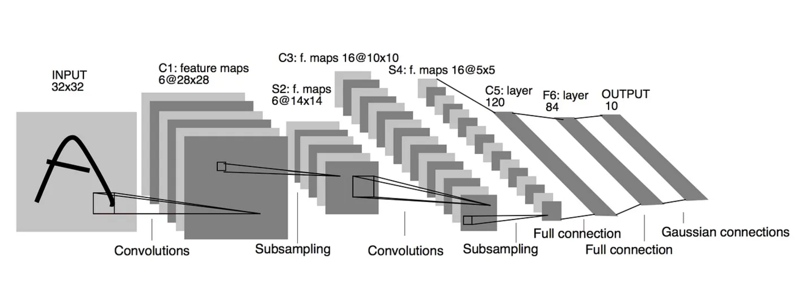
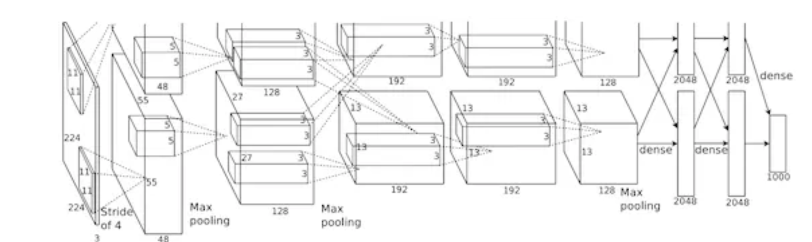
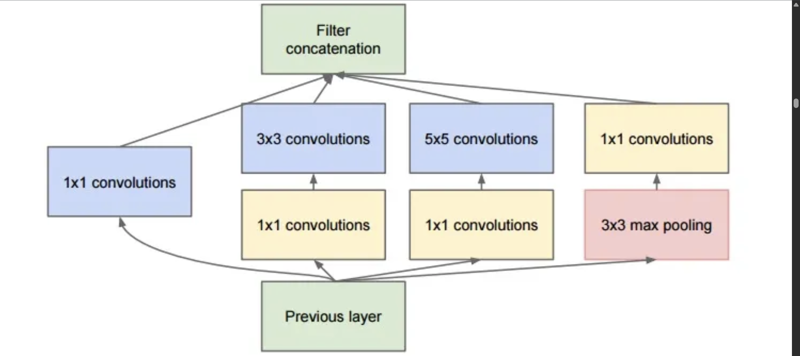
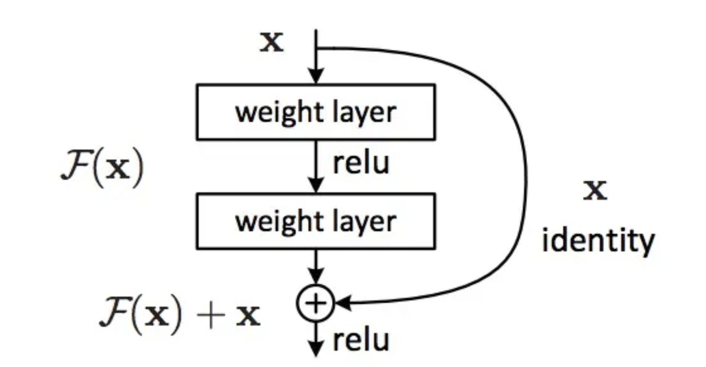

# LeNet5

Convolutions with learnable parameters are an effective way to extract similar features at multiple location with few parameters
Therefore being able to save parameters and computation was a key advantage
This is in contrast to using each pixel as a separate input of a large multi-layer neural network.

LeNet5 explained that those should not be used in the first layer, because images are highly spatially correlated, and using individual pixel of the image as separate input features would not take advantage of these correlations.

convolutional neural network use sequence of 3 layers:

- convolution
- pooling
- non-linearity

## estructura:

- use convolution to extract spatial features
- subsample using spatial average of maps
- non-linearity in the form of tanh or sigmoids
- multi-layer neural network (MLP) as final classifier
- sparse connection matrix between layers to avoid large computational cost

# AlexNet

which was a deeper and much wider version of the LeNet

much larger neural network that could be used to learn much more complex objects and object hierarchies

- use of rectified linear units (ReLU) as non-linearities
- use of dropout technique to selectively ignore single neurons during training, a way to avoid overfitting of the model
- overlapping max pooling, avoiding the averaging effects of average pooling

Convolutional neural network were now the workhorse of Deep Learning
I believe it is better to learn to segment objects rather than learn artificial bounding boxes.

# VGG

were the first to use much smaller 3×3 filters in each convolutional layers and also combined them as a sequence of convolutions
This seems to be contrary to the principles of LeNet, where large convolutions were used to capture similar features in an image
filters started to become smaller, too dangerously close to the infamous 1×1 convolutions that LeNet wanted to avoid

But the great advantage of VGG was the insight that multiple 3×3 convolution in sequence can emulate the effect of larger receptive fields, for examples 5×5 and 7×7.

The VGG networks uses multiple 3x3 convolutional layers to represent complex features.
are used multiple times in sequence to extract more complex features and the combination of such features.
Reducing the number of features, will save some of the computational cost.

# Network-in-network

using 1x1 convolutions to provide more combinational power to the features of a convolutional layers.
used spatial MLP layers after each convolution, in order to better combine features before another layer.
Again one can think the 1x1 convolutions are against the original principles of LeNet, but really they instead help to combine convolutional features in a better way, which is not possible by simply stacking more convolutional layers.

Here 1×1 convolution are used to spatially combine features across features maps after convolution, so they effectively use very few parameters, shared across all pixels of these features
The power of MLP can greatly increase the effectiveness of individual convolutional features by combining them into more complex groups.
NiN also used an average pooling layer as part of the last classifier, another practice that will become common.
This was done to average the response of the network to multiple are of the input image before classification.

# GoogLeNet and Inception

the first Inception architecture.
deep learning models were becoming extermely useful in categorizing the content of images and video frames.
Christian thought a lot about ways to reduce the computational burden of deep neural nets while obtaining state-of-art performance

But the great insight of the inception module was the use of 1×1 convolutional blocks (NiN) to reduce the number of features before the expensive parallel blocks.
GoogLeNet used a stem without inception modules as initial layers, and an average pooling plus softmax classifier similar to NiN. This classifier is also extremely low number of operations

# Bottleneck layer

was reducing the number of features, and thus operations, at each layer, so the inference time could be kept low.
Before passing data to the expensive convolution modules, the number of features was reduce by, say, 4 times. This led to large savings in computational cost, and the success of this architecture.

Let’s say you have 256 features coming in, and 256 coming out, and let’s say the Inception layer only performs 3x3 convolutions. That is 256x256 x 3x3 convolutions that have to be performed (589,000s multiply-accumulate, or MAC operations).

instead of doing this, we decide to reduce the number of features that will have to be convolved, say to 64 or 256/4. In this case, we first perform 256 -> 64 1×1 convolutions, then 64 convolution on all Inception branches, and then we use again a 1x1 convolution from 64 -> 256 features back again.

- 256×64 × 1×1 = 16,000s
- 64×64 × 3×3 = 36,000s
- 64×256 × 1×1 = 16,000s
  For a total of about 70,000 versus the almost 600,000 we had before.

And although we are doing less operations, we are not losing generality in this layer.

The reason for the success is that the input features are correlated, and thus redundancy can be removed by combining them appropriately with the 1x1 convolutions.

# Inception V3 (and V2)

Batch-normalization computes the mean and standard-deviation of all feature maps at the output of a layer, and normalizes their responses with these values.
making all the neural maps have responses in the same range, and with zero mean. This helps training as the next layer does not have to learn offsets in the input data, and can focus on how to best combine features.

- maximize information flow into the network, by carefully constructing networks that balance depth and width. Before each pooling, increase the feature maps.
- when depth is increased, the number of features, or width of the layer is also increased systematically
- use width increase at each layer to increase the combination of features before next layer
- use only 3x3 convolution, when possible, given that filter of 5x5 and 7x7 can be decomposed with multiple 3x3.

# Arquitectura ResNet (red residual)

Deep neural networks and Deep Learning are powerful and popular algorithms.
A lot of their success lays in the careful design of the neural network architecture

feed the output of two successive convolutional layer AND also bypass the input to the next layers

But here they bypass TWO layers and are applied to large scales. Bypassing after 2 layers is a key intuition, as bypassing a single layer did not give much improvements. By 2 layers can be thought as a small classifier, or a Network-In-Network!

ResNet with a large number of layers started to use a bottleneck layer
This layer reduces the number of features at each layer by first using a 1x1 convolution with a smaller output (usually 1/4 of the input), and then a 3x3 layer, and then again a 1x1 convolution to a larger number of features.
this allows to keep the computation low, while providing rich combination of features.
ResNet uses a fairly simple initial layers at the input (stem): a 7x7 conv layer followed with a pool of 2
ResNet also uses a pooling layer plus softmax as final classifier.

- ResNet can be seen as both parallel and serial modules, by just thinking of the inout as going to many modules in parallel, while the output of each modules connect in series
- ResNet can also be thought as multiple ensembles of parallel or serial modules
- ResNet, when the output is fed back to the input, as in RNN, the network can be seen as a better bio-plausible model of the cortex

